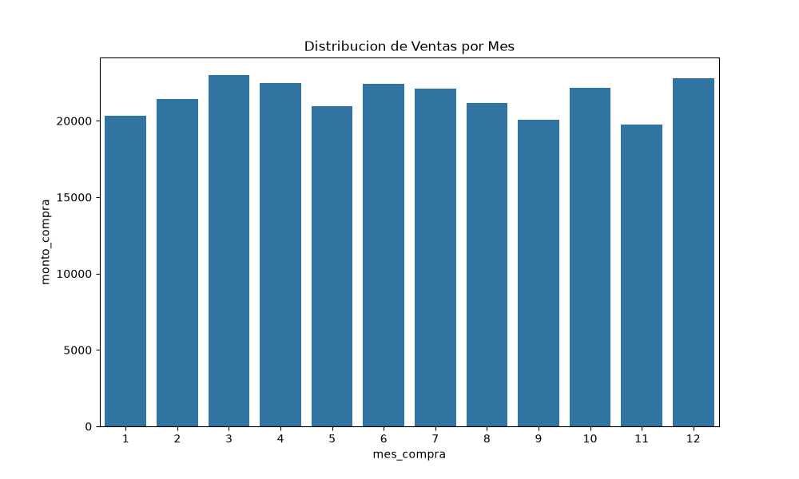
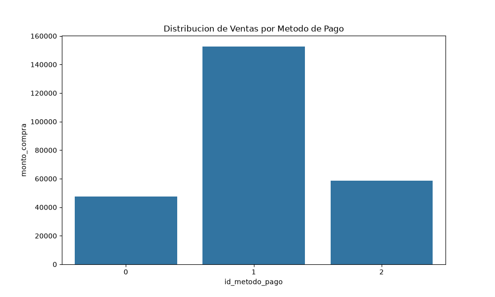
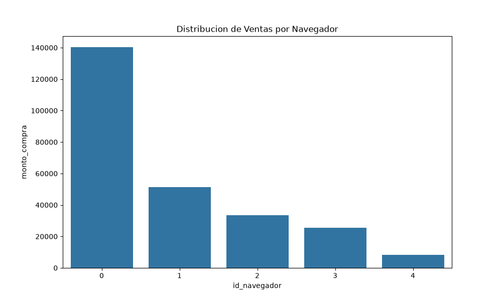
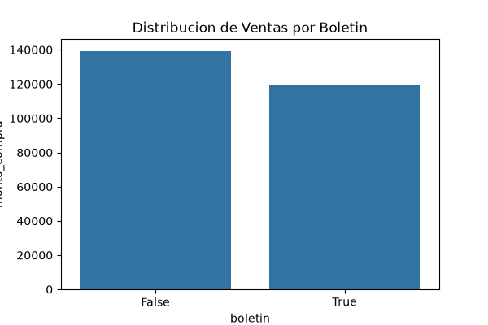
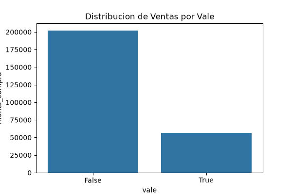

# Resultados del Analisis Descriptivo

## Explicacion de Hallazgos
El analisis revela que el navegador mas preferido es el 0, mientras que el menos popular es el 4. Las mayores ventas ocurren en el mes 3.0 y las menores en el mes 11.0. En cuanto a las promociones, los boletines tuvieron su mayor uso en el mes 12, y los vales en el mes 3. Se nota que los jovenes (19-35) y adultos (36-50) concentran el mayor volumen de compras, con poca diferencia entre generos.

## Estadisticas Basicas
| Variable     |    Media |   Mediana |    Moda |
|:-------------|---------:|----------:|--------:|
| edad         |  36.3052 |    36     |  18     |
| venta_total  | 206.242  |   137.35  |  98     |
| n_compras    |   5.09   |     4     |   2     |
| monto_compra |  39.7871 |    35.764 |  37.145 |
| tiempo_sitio | 767.376  |   768     | 852     |

## Analisis de Tendencias
- Mes de Mayores Ventas: Mes 3.0 con monto de 22994.336
- Mes de Menores Ventas: Mes 11.0 con monto de 19779.238
- Navegador mas preferido: 0, menos popular: 4
- Ventas totales pagadas en efectivo (o contra entrega): 47465.644
- Mes con mas uso de boletines: Mes 12 (262 usos)
- Mes con mas uso de vales: Mes 3 (133 usos)

### Detalle de Navegadores
|   id_navegador |   cantidad |
|---------------:|-----------:|
|              0 |       3523 |
|              1 |       1273 |
|              2 |        847 |
|              3 |        660 |
|              4 |        197 |

## Segmentacion de Clientes
### Por Edad
| grupo_edad    |   total_ventas |   promedio_venta |   total_compras |
|:--------------|---------------:|-----------------:|----------------:|
| Menores de 18 |        17847   |          38.3806 |            2557 |
| 19-35         |       108054   |          39.5801 |           14245 |
| 36-50         |       102629   |          40.2152 |           12769 |
| Mayores de 50 |        30086.2 |          39.9551 |            3514 |
### Por Genero
|   id_genero |   total_ventas |   promedio_venta |   total_compras |
|------------:|---------------:|-----------------:|----------------:|
|           0 |         133861 |          39.6979 |           17176 |
|           1 |         124755 |          39.8832 |           15909 |
### Por Uso de Promociones (Boletin, Vale)
| boletin   | vale   |   total_ventas |   promedio_venta |   total_compras |
|:----------|:-------|---------------:|-----------------:|----------------:|
| False     | False  |       119999   |          38.2649 |           14425 |
| False     | True   |        19323.2 |          43.6189 |            1899 |
| True      | False  |        82246.2 |          38.9793 |           12135 |
| True      | True   |        37047.6 |          45.6814 |            4626 |

## Proceso de Analisis (Para el Informe Final)
### Decisiones tomadas durante el analisis exploratorio
- Se decidio cargar los datos directamente de la base de datos en AWS usando pandas y SQLAlchemy para mantener la consistencia con el trabajo del Integrante 1.
- Para la agrupacion por edades, se crearon categorias predefinidas (Menores de 18, 19-35, 36-50, Mayores de 50) que permiten una segmentacion comercial mas util que ver la edad cruda.
- Se generaron graficos de distribucion base (barras) para visualizar rapidamente el comportamiento de las ventas segun las variables categoricas principales.

### Desafios encontrados y como se superaron
- **Desafio**: Dificultades iniciales para establecer la conexion con la RDS en la nube debido a configuraciones de red y reglas de seguridad.
- **Solucion**: Coordinacion en equipo para abrir el acceso del Security Group en AWS al puerto 5432, lo que permitio ejecutar los scripts locales contra la DB de produccion.
- **Desafio**: Asegurar que las variables de entorno para la base de datos se leyeran correctamente sin arruinar la configuracion local.
- **Solucion**: Uso de la libreria `python-dotenv` apuntando al `.env` en la raiz de la carpeta `Practica1`.


## Visualizaciones Generadas
A continuacion se presentan las graficas para el analisis exploratorio:

### 1. Ventas por Mes

*Explicacion*: Se observa la distribucion del monto total de compras agrupadas por mes, permitiendo identificar claramente los picos de ventas durante el año.

### 2. Ventas por Metodo de Pago

*Explicacion*: Compara el volumen de ingresos segun el metodo de pago utilizado (0: Efectivo, 1: Tarjeta de Credito, 2: Tarjeta de Debito).

### 3. Ventas por Navegador

*Explicacion*: Muestra el comportamiento de compra segmentado por el navegador que utilizo el cliente.

### 4. Ventas con Boletin

*Explicacion*: Visualiza el monto de ventas comparando las transacciones que utilizaron un boletin versus las que no.

### 5. Ventas con Vale

*Explicacion*: Contrasta las ventas donde se aplico un vale promocional contra las que no.

## Explicacion Paso a Paso del Script de Analisis (`AnalisisDescriptivo.py`)
El script fue disenado para automatizar la extraccion y calculo de estadisticas de la base de datos de AWS. A continuacion se detalla su funcionamiento paso a paso:

### 1. Conexion a la Base de Datos
Se utiliza la libreria `dotenv` para leer las credenciales seguras y `sqlalchemy` para conectarse a PostgreSQL.
```python
def ObtenerConexionDb():
    load_dotenv(dotenv_path='../.env')
    Url = f"postgresql+psycopg2://{User}:{Password}@{Host}:{Port}/{Name}?sslmode={SslMode}"
    return create_engine(Url)
```

### 2. Extraccion y Union de Datos (ETL en memoria)
Se extraen las tablas principales mediante consultas SQL directas y se unen (`merge`) usando Pandas para obtener un dataset completo por cliente.
```python
DfClientes = pd.read_sql("SELECT * FROM ventas.clientes;", Engine)
DfCompras = pd.read_sql("SELECT * FROM ventas.compras;", Engine)
DfCompleto = pd.merge(DfCompras, DfClientes, on="id_cliente", how="inner")
```

### 3. Calculo de Estadisticas y Segmentacion
Aprovechando las funciones de agregacion de Pandas (`.mean()`, `.median()`, `.mode()`), calculamos las estadisticas basicas y utilizamos `.groupby()` para segmentar.
```python
VentasPorMes = DfCompras.groupby('mes_compra')['monto_compra'].sum().reset_index()
ComprasPorEdad = DfCompleto.groupby('grupo_edad')['monto_compra'].sum().reset_index()
```

### 4. Generacion de Graficos (Visualizacion)
Finalmente, se emplean `seaborn` y `matplotlib` para renderizar los graficos y exportarlos como imagenes `.png` listas para el informe.
```python
sns.barplot(data=VentasPorMes, x='mes_compra', y='monto_compra')
plt.savefig('ventas_por_mes.png')
```

