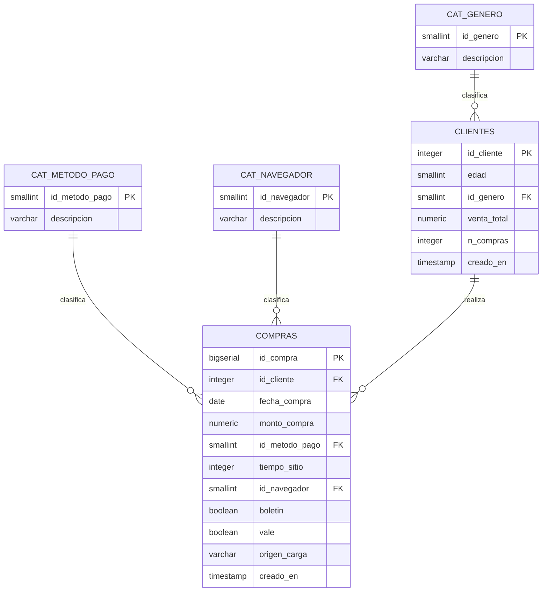

# SOG2 – Práctica 1 (2S26) 

**Integrante 1 – Base de Datos y ETL**
Sistemas Organizacionales y Gerenciales 2 — USAC / FIUSAC

Este módulo cubre la primera parte de la Práctica 1: extracción y limpieza del
archivo `Venta_online_c.csv`, diseño e implementación de la base de datos
relacional en la nube (AWS RDS – PostgreSQL), en local y el script de carga (ETL).

---

## 1. Arquitectura

```
Venta_online_c.csv
        │
        ▼
   etl/etl.py  ──(pandas: extracción y limpieza)──► DataFrame validado
        │
        ▼
  SQLAlchemy + psycopg2  ──(carga)──►  AWS RDS (PostgreSQL)/ Instancia docker compose en local
                                        schema: ventas
                                        ├── cat_genero
                                        ├── cat_metodo_pago
                                        ├── cat_navegador
                                        ├── clientes
                                        ├── compras
                                        └── vw_ventas (vista consolidada)
```

## 2. Estructura del repositorio

```
├── README.md
├── .gitignore
├── docker-compose.yml
├── .env.example
├── sql/
│   └── schema.sql            # DDL: catálogos, tablas, índices, vista
└── etl/
    ├── etl.py                    # Extracción, limpieza, transformación y carga
    ├── data_quality_report.py    # Auditoría de calidad de datos (evidencia)
    ├── Venta_online_c.csv        # Archivo de origen (colocar aquí)
    ├── requirements.txt
    └── .env.example              # Plantilla de credenciales (copiar a .env)
```

> `etl.py` busca por defecto el archivo `Venta_online_c.csv` **en su mismo
> directorio** (`etl/`), no es necesario indicar la ruta al ejecutarlo.

---

## 3. Modelo de datos

### 3.1 Decisión de diseño

El CSV de origen trae **una fila por cliente**, mezclando datos propios del
cliente (`Edad`, `Genero`, `Venta_total`, `N_Compras`) con los datos de
**una transacción puntual** (`FechaCompra`, `MontoCompra`, `MetodoPago`,
`Tiempo`, `Navegador`, `Boletin`, `Vale`).

Para evitar duplicar información y dejar la base lista para crecer (más
compras por cliente, nuevos canales, sucursal física, etc.), se separó el
modelo en dos entidades con relación **1:N** (`clientes` → `compras`), más
tres catálogos para los campos codificados como enteros en el CSV.

### 3.2 Diagrama Entidad-Relación




### 3.3 Diccionario de datos (resumen)

| Tabla | Campo | Tipo | Descripción |
|---|---|---|---|
| clientes | id_cliente | INTEGER (PK) | Identificador único del cliente (viene del CSV) |
| clientes | edad | SMALLINT | Edad del cliente |
| clientes | id_genero | SMALLINT (FK) | 0=Masculino, 1=Femenino |
| clientes | venta_total | NUMERIC(12,2) | Venta acumulada histórica del cliente |
| clientes | n_compras | INTEGER | Número de compras acumuladas del cliente |
| compras | id_compra | BIGSERIAL (PK) | Identificador autogenerado de la transacción |
| compras | id_cliente | INTEGER (FK) | Cliente que realizó la compra |
| compras | fecha_compra | DATE | Fecha de la transacción (parseada de `DD.MM.YY`) |
| compras | monto_compra | NUMERIC(12,3) | Monto de esa transacción específica |
| compras | id_metodo_pago | SMALLINT (FK) | 0=Efectivo, 1=Tarjeta Crédito, 2=Tarjeta Débito |
| compras | tiempo_sitio | INTEGER | Tiempo (segundos) en sitio/tienda |
| compras | id_navegador | SMALLINT (FK) | 0=Tienda Física, 1-4=Navegador 1-4 |
| compras | boletin | BOOLEAN | Si el cliente usó boletín en la compra |
| compras | vale | BOOLEAN | Si el cliente usó vale en la compra |
| compras | origen_carga | VARCHAR | Trazabilidad del lote de carga (ej. `csv_2021`) |

La vista `ventas.vw_ventas` expone todo lo anterior ya unido y con las
etiquetas de catálogo resueltas (`genero`, `metodo_pago`, `navegador`),
además de `mes_compra` / `anio_compra` calculados, para simplificar las
consultas de análisis exploratorio y del agente de IA.

---

## 4. Proceso de limpieza de datos (ETL)

Sobre el archivo `Venta_online_c.csv` (6,500 filas, separador `;`) se aplicó,
en `etl/etl.py`, el siguiente proceso:

1. **Extracción**: lectura del CSV con `pandas`, validando que existan las
   12 columnas esperadas.
2. **Duplicados**: se eliminan filas exactamente duplicadas y filas con
   `Id_cliente` repetido (se conserva la primera ocurrencia). En el archivo
   entregado no se encontraron duplicados (6,500 `Id_cliente` únicos).
3. **Valores nulos**: se eliminan filas con nulos en cualquier columna
   crítica. En el archivo entregado no se encontraron valores nulos.
4. **Tipos de datos**:
   - `FechaCompra` viene como texto `DD.MM.YY` (ej. `02.02.21`) y se convierte
     a `DATE` real (`2021-02-02`).
   - `Venta_total` y `MontoCompra` se convierten a `float`/`NUMERIC`.
   - `Genero`, `MetodoPago`, `Navegador`, `Boletin`, `Vale` se validan como
     enteros dentro de su dominio permitido y `Boletin`/`Vale` se castean a
     `BOOLEAN`.
5. **Validación de dominio**: filas cuyo `Genero`, `MetodoPago` o
   `Navegador` no estén dentro de los códigos definidos en el enunciado se
   descartan y se reportan en el log (no se encontraron casos en el CSV
   entregado, pero la regla queda activa para futuras cargas).
6. **Validación de rangos lógicos**: edades fuera de 0–120, o montos/tiempos
   negativos, se descartan (tampoco se encontraron casos, es una regla de
   seguridad para cargas futuras).
7. **Transformación**: el DataFrame limpio se separa en dos DataFrames
   (`clientes`, `compras`) que reflejan el modelo relacional.
8. **Carga**: se insertan primero `clientes` y luego `compras` (por la
   llave foránea), usando `to_sql(..., method="multi", chunksize=500)` para
   una carga eficiente por lotes.
9. **Verificación**: al final se hace un `SELECT COUNT(*)` de ambas tablas y
   se deja registrado en el log para confirmar que la carga fue completa.

Todo el proceso queda registrado con timestamps en consola (nivel `INFO`
para el flujo normal y `WARNING` cuando se descarta algún registro), lo que
sirve como evidencia del proceso para el informe final.

### 4.1 Evidencia: auditoría de calidad de datos

Antes de dar por buena la limpieza, se corrió una auditoría exhaustiva sobre
las 6,500 filas del CSV de origen (`etl/data_quality_report.py`), verificando
todas las reglas que aplica el ETL. **Resultado: el archivo entregado no
presentó ninguna inconsistencia** — 0 nulos, 0 duplicados, 0 valores fuera de
dominio o de rango lógico:

| Validación | Resultado | Estado |
|---|---|---|
| Total de filas leídas | 6500 | ✅ OK |
| Valores nulos (todas las columnas) | 0 | ✅ OK |
| Filas duplicadas (exactas) | 0 | ✅ OK |
| `Id_cliente` duplicados | 0 | ✅ OK |
| `Genero` fuera de dominio {0,1} | 0 | ✅ OK |
| `MetodoPago` fuera de dominio {0,1,2} | 0 | ✅ OK |
| `Navegador` fuera de dominio {0..4} | 0 | ✅ OK |
| `Boletin` fuera de dominio {0,1} | 0 | ✅ OK |
| `Vale` fuera de dominio {0,1} | 0 | ✅ OK |
| Fechas inválidas / no parseables (`DD.MM.YY`) | 0 | ✅ OK |
| Fechas fuera del año 2021 | 0 | ✅ OK |
| Edad fuera de rango [0,120] | 0 | ✅ OK |
| `Venta_total` ≤ 0 | 0 | ✅ OK |
| `MontoCompra` ≤ 0 | 0 | ✅ OK |
| `Tiempo` ≤ 0 | 0 | ✅ OK |
| `N_Compras = 0` con `Venta_total > 0` (inconsistencia) | 0 | ✅ OK |
| `MontoCompra > Venta_total` (inconsistencia) | 0 | ✅ OK |

Esto no significa que el paso de limpieza esté de más: las reglas quedan
**activas e implementadas** en `etl.py` (ver secciones 2–6 arriba) para
proteger la integridad de cualquier carga futura (nuevos CSV, datos de la
sucursal física, correcciones manuales, etc.), tal como pide el enunciado.

Para reproducir esta auditoría:

```powershell
cd etl
python data_quality_report.py
# o para guardar el resultado como evidencia en Markdown:
python data_quality_report.py --out reporte_calidad.md
```

---

## 5. Cómo levantar la base de datos en AWS RDS

1. En la consola de AWS → **RDS → Create database**.
   - Engine: **PostgreSQL** (versión 16.x recomendada).
   - Templates: *Free tier* (suficiente para esta práctica).
   - DB instance identifier: `sog2-ventas-online`.
   - Master username / password: definirlos (usarlos luego en `.env`).
2. **Connectivity**: marcar *Publicly accessible = Yes* (para poder conectar
   desde la máquina local durante el desarrollo) y crear/editar el
   **Security Group** para permitir el puerto `5432` desde tu IP.
3. Esperar a que el estado sea *Available* y copiar el **Endpoint**
   (host) que aparece en la pestaña *Connectivity & security*.
4. Con esos datos llenar el archivo `.env` (ver sección 6).
5. Ejecutar el script `sql/schema.sql` contra la base de datos, por ejemplo
   con `psql`:
   ```powershell
   psql "host=<endpoint> port=5432 dbname=postgres user=postgres sslmode=prefer" -f sql/schema.sql
   ```
   (también puede ejecutarse desde **pgAdmin** o **DBeaver** pegando el
   contenido del archivo en el *Query Tool*).

---

## 6. Cómo ejecutar el ETL en Windows (entorno virtual)

> **Requisito de versión de Python:** las dependencias fijadas en
> `requirements.txt` tienen wheels precompilados para **Python 3.10 a 3.14**
> en Windows (`win_amd64`), por lo que la instalación no requiere compilador
> de C/C++. Si usás una versión de Python distinta y `pip install` intenta
> compilar desde el código fuente (verás algo como `Building wheel...` o un
> error de `meson`/`vswhere.exe`), lo más simple es instalar Python 3.12 o
> 3.13 (LTS más probados) o actualizar `requirements.txt` a versiones más
> recientes con `pip install -U pandas SQLAlchemy psycopg2-binary python-dotenv`.

```powershell
cd etl
# 1. Crear el entorno virtual
python -m venv .venv

# 2. Activarlo
.venv\Scripts\Activate


# 3. Instalar dependencias
pip install -r requirements.txt

# 4. Configurar credenciales, copiar de .env.example


# 5. Colocar el archivo "Venta_online_c.csv" dentro de la carpeta etl\
#    (junto a etl.py). El script lo detecta automaticamente.

# 6. (Ya se ejecutó sql/schema.sql en el paso anterior contra el RDS)

# 7. Validar el proceso sin escribir en la base (dry run)
cd etl
python etl.py --dry-run

# 8. Cargar de verdad
python etl.py

# (Opcional) volver a cargar desde cero
python etl.py --truncate

# (Opcional) usar un CSV en otra ubicacion o con otro nombre
python etl.py --csv "C:\ruta\a\otro_archivo.csv"
```

Al finalizar, el script imprime en consola el conteo de filas cargadas en
`ventas.clientes` y `ventas.compras` como verificación.

---

## 7. Consultas de ejemplo (para el equipo de análisis)

```sql
-- Todo ya unido y legible, listo para EDA
SELECT * FROM ventas.vw_ventas LIMIT 20;

-- Ventas totales por mes
SELECT mes_compra, SUM(monto_compra) AS total
FROM ventas.vw_ventas
GROUP BY mes_compra
ORDER BY mes_compra;

-- Navegador más usado
SELECT navegador, COUNT(*) AS usos
FROM ventas.vw_ventas
GROUP BY navegador
ORDER BY usos DESC;
```

---

## 8. Próximos pasos (para los siguientes integrantes)

- **Análisis exploratorio / tendencias / segmentación / correlación**:
  consultar directamente `ventas.vw_ventas` desde Python (R o Python +
  SQLAlchemy) o el notebook que se agregue en una carpeta `analisis/`.
- **Visualizaciones**: agregar carpeta `visualizacion/` con los notebooks o
  scripts que generen los 7+ gráficos requeridos.
- **Agente de IA (Google ADK + MCP Server)**: el MCP Server puede exponer
  como *tools* consultas SQL parametrizadas contra `ventas.vw_ventas` (y
  contra `clientes`/`compras` si se necesita detalle transaccional), sin
  necesidad de volver a tocar el ETL.
- Si se agregan nuevas fuentes de datos (p. ej. ventas de la sucursal
  física), pueden insertarse directamente en `ventas.compras` usando el
  campo `origen_carga` para diferenciarlas, sin modificar el esquema.
