# Justificación — Integrante 4: Correlaciones y Gráficos

**Módulo:** `Practica1/graficacion/`
**Fuente de datos:** vista consolidada `ventas.vw_ventas` (PostgreSQL) — 6,500 registros de ventas online 2021.
**Scripts:** `graficas.py` (8 gráficos) y `correlaciones.py` (4 gráficos de correlación), ambos generan sus salidas en `graficas/`.

---

## 1. Estudio de Correlaciones

Para este punto lo primero que hicimos fue decidir cómo íbamos a medir las relaciones que pedía el enunciado. Para las variables numéricas usamos el coeficiente de correlación de Pearson, que nos da un número entre -1 y 1 y nos dice si dos variables se mueven juntas; para las variables categóricas, en cambio, un número no tiene sentido, así que decidimos armar tablas de contingencia (cruces de frecuencias) que se ven mucho mejor en un heatmap. Así, cada una de las tres relaciones pedidas quedó evaluada con el gráfico que mejor le iba.

### 1.1 Venta vs. Edad

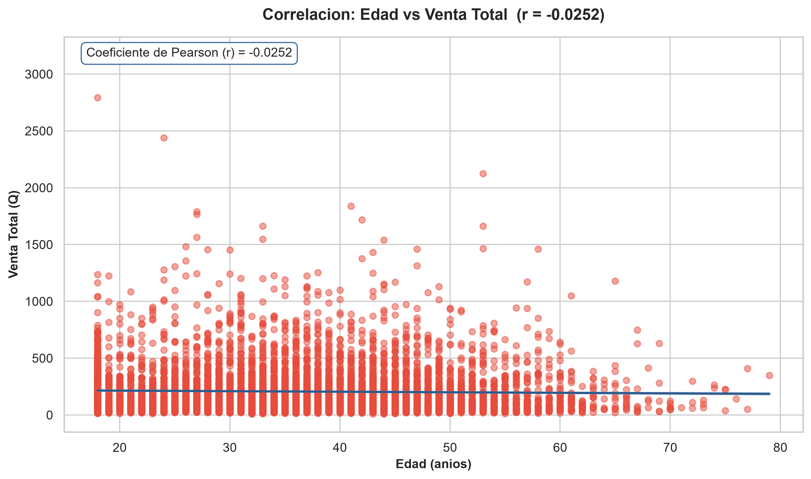

Para esta relación nos preguntábamos algo muy concreto: ¿gasta más un cliente joven que uno mayor, o al revés? Para responderlo decidimos usar una nube de puntos con recta de regresión. En el eje horizontal (X) va la edad del cliente en años, y en el eje vertical (Y) va su venta total acumulada en quetzales; cada punto representa a uno de los 6,500 clientes. La recta azul que atraviesa la nube es la "tendencia" que dibujan los puntos: si tuviera pendiente hacia arriba significaría que a mayor edad se gasta más, y si fuera hacia abajo, lo contrario.

Al calcular el coeficiente nos dio `r = -0.0252`, un número tan cercano a cero que prácticamente no dice nada. Y eso es exactamente la conclusión: la recta sale casi plana y los puntos están dispersos por todos lados sin ningún patrón. Cada vez que la edad sube un año, la venta total no sube ni baja de forma consistente; simplemente se queda igual de dispersa. En pocas palabras, **la edad no es un factor que determine cuánto gasta un cliente**, y eso es un hallazgo interesante para el negocio.

### 1.2 Género vs. Método de Pago

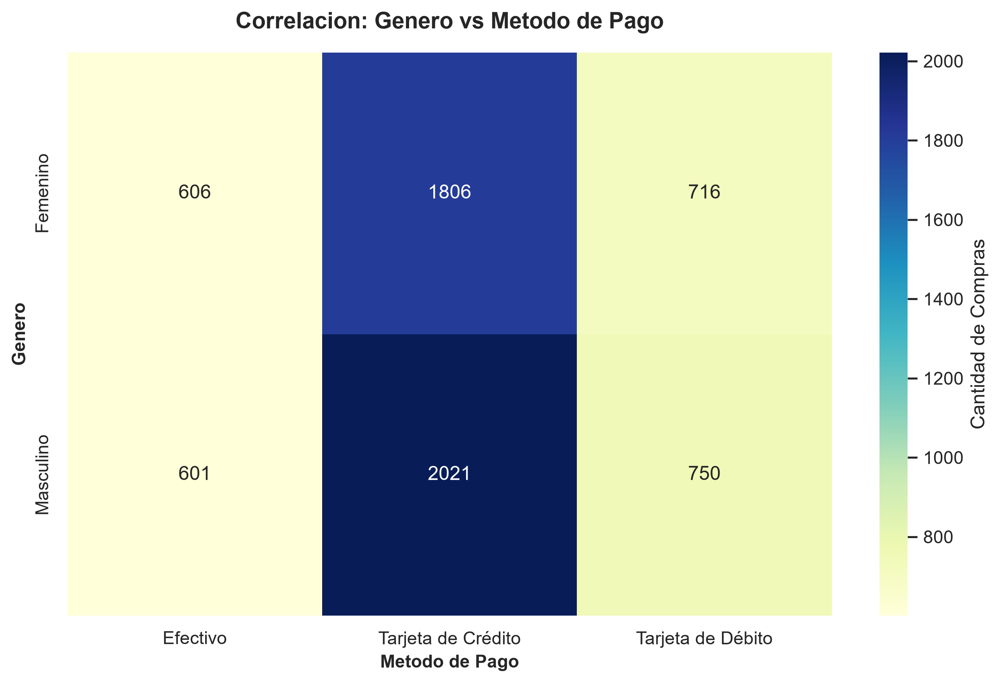

Aquí la pregunta era si el género influye en la forma de pagar. Como ambas variables son categóricas (hombre/mujer y efectivo/crédito/débito), un coeficiente numérico no aplica, así que decidimos cruzar las dos en una tabla de contingencia y pintarla como heatmap: en el eje vertical (Y) quedó el género y en el horizontal (X) el método de pago, y cada celda muestra con su color y su número cuántas compras cayeron en esa combinación. Entre más oscuro el color, mayor la cantidad.

| Género     | Efectivo | Tarjeta de Crédito | Tarjeta de Débito | Total |
|------------|---------:|-------------------:|------------------:|------:|
| Femenino   |      606 |              1,806 |               716 | 3,128 |
| Masculino  |      3372 |              2,021 |               750 | 3,372 |

Al ver la tabla saltó a la vista algo claro: en ambos géneros la tarjeta de crédito domina por mucho (el 58% de las mujeres y el 60% de los hombres pagan con ella), y en ambos el efectivo es el método menos usado. Las dos filas del heatmap tienen casi la misma forma y los mismos colores. Eso nos dice que **el género no cambia la preferencia de pago**: hombres y mujeres se comportan prácticamente igual, así que no hay una correlación relevante entre estas dos variables.

### 1.3 Boletines vs. Vales

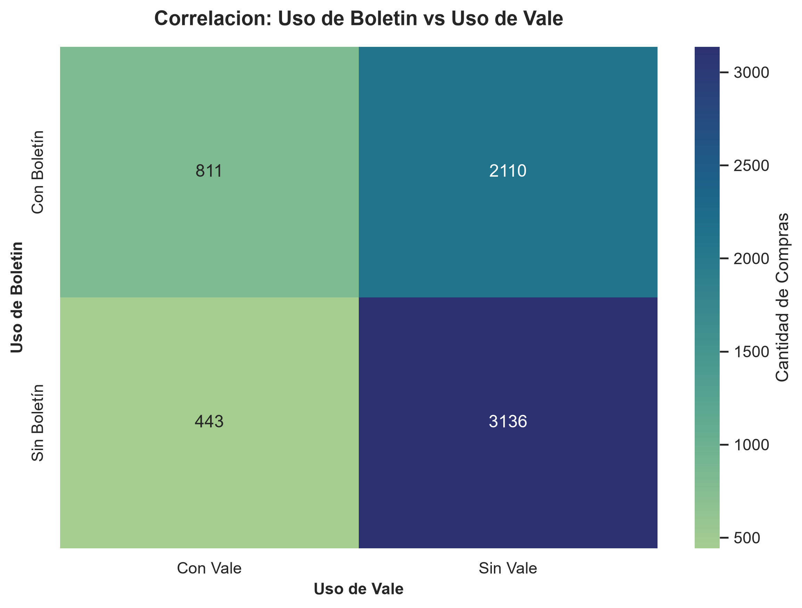

La última relación pedida era entre el uso de boletín y el uso de vale, y aquí la intuición nos decía que podía haber algo interesante: quizá los clientes que usan un beneficio tienden a usar el otro. Para comprobarlo armamos otra tabla de contingencia y la pintamos como heatmap: el eje vertical (Y) es el uso de boletín, el eje horizontal (X) el uso de vale, y cada celda cuenta cuántas compras cayeron en cada combinación.

| Boletín | Sin Vale | Con Vale | Total |
|---------|---------:|---------:|------:|
| Sin     |    3,136 |      443 | 3,579 |
| Con     |    2,110 |      811 | 2,921 |

Y aquí sí hubo hallazgo. Entre las 1,254 compras que usaron vale, el 64.7% (811) también usaron boletín; pero entre las compras sin vale, solo el 40.2% usó boletín. O sea: cada vez que un cliente usa un vale, la probabilidad de que también esté suscrito al boletín sube de forma notable. Eso se ve en el heatmap como una celda "Con Boletín / Con Vale" con un color más fuerte que el resto de la fila. La lectura práctica es que **las dos promociones se complementan**, y podrían potenciarse en campañas conjuntas.

### 1.4 Correlaciones adicionales (soporte al informe)

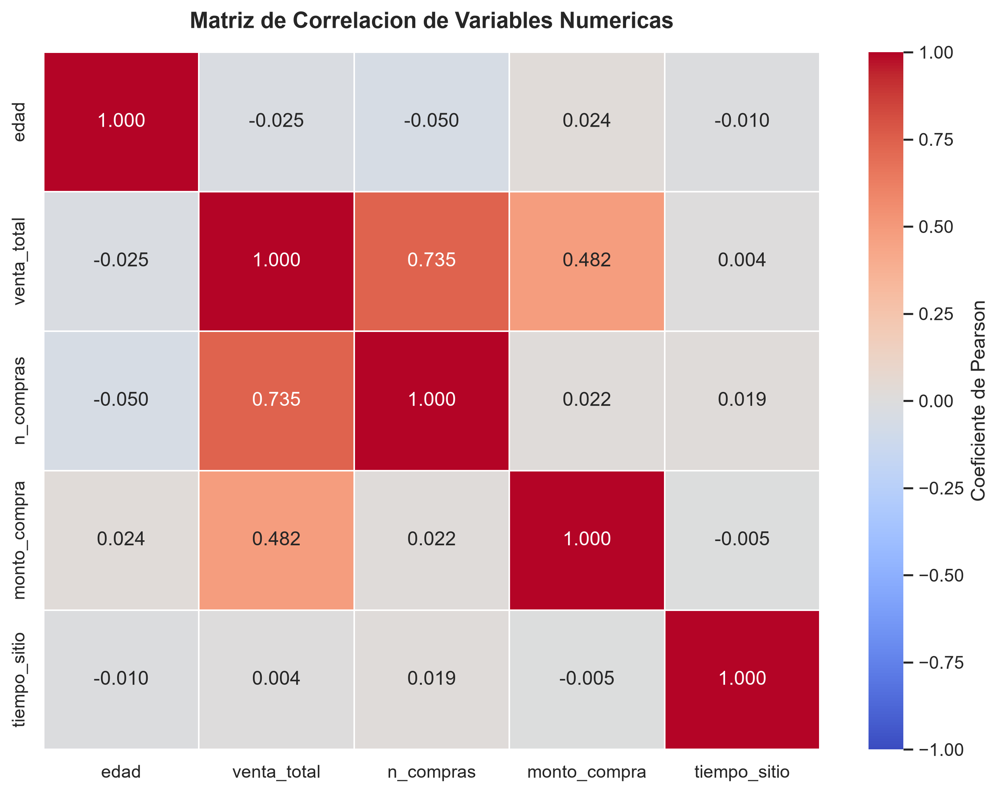

Además de las tres pedidas, decidimos sacar la matriz de correlación completa de todas las variables numéricas (edad, venta_total, n_compras, monto_compra y tiempo_sitio) como apoyo para el informe. La pintamos como heatmap donde cada celda es el coeficiente r entre un par de variables: rojo para correlación positiva fuerte, azul para negativa, y los tonos pálidos para las que no se relacionan.

|                | edad | venta_total | n_compras | monto_compra | tiempo_sitio |
|----------------|-----:|------------:|----------:|-------------:|-------------:|
| edad           | 1.000 | -0.025     | -0.050    | 0.024        | -0.010      |
| venta_total    | -0.025 | 1.000     | **0.735** | 0.482        | 0.004       |
| n_compras      | -0.050 | 0.735      | 1.000     | 0.022        | 0.019       |
| monto_compra   | 0.024  | 0.482      | 0.022     | 1.000        | -0.005      |
| tiempo_sitio   | -0.010 | 0.004      | 0.019     | -0.005       | 1.000       |

El resultado más llamativo es que `venta_total` y `n_compras` tienen un `r = 0.735`, una correlación fuerte y esperada (a más compras registradas, más alta la venta acumulada), lo que además nos sirve de validación de que los datos cargados son consistentes. El `tiempo_sitio`, en cambio, anda en cero contra todo, confirmando que el tiempo que pasa un cliente en el sitio no dice nada sobre cuánto gasta.

---

## 2. Visualizaciones

Se generaron **12 gráficos en total** (8 variados + 4 de correlación), con lo que se supera el mínimo de 7 gráficos variados que pide el enunciado. Todos se exportan en alta resolución (300 DPI) a la carpeta `graficas/`. A continuación explicamos qué decidimos graficar, cómo lo diseñamos y qué leemos en cada uno.

### 2.1 Tendencia de Ventas por Mes (líneas)

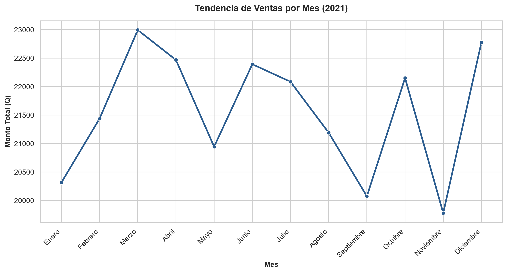

Para ver cómo se comportaban las ventas a lo largo del año decidimos usar un gráfico de líneas, que es el más natural para series de tiempo. En el eje horizontal (X) pusimos los meses de enero a diciembre y en el vertical (Y) el monto total vendido en quetzales; cada punto es la venta de un mes y la línea los une para que se lea la evolución de un vistazo.

Si recorremos la línea mes a mes, lo primero que salta es que marzo (Q22,994.34) y diciembre (Q22,778.09) son los picos del año, mientras que noviembre (Q19,779.24) es el valle. Pero ojo: la diferencia entre el mejor y el peor mes es de apenas ~14%, es decir, la línea se mantiene relativamente plana y no hay una estacionalidad marcada. El negocio se mueve parejo durante todo el año.

### 2.2 Ventas por Método de Pago (barras)

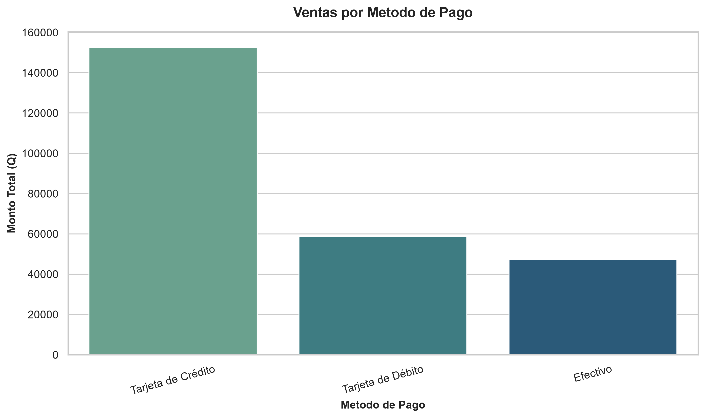

Cuando quisimos comparar cuánto dinero entraba por cada método de pago, decidimos usar barras verticales y ordenarlas de mayor a menor, porque así el ojo cae directo al canal que más aporta. En el eje horizontal (X) está cada método y en el vertical (Y) el monto total vendido.

La lectura es inmediata: la tarjeta de crédito genera Q152,601.47, que es el 59% de todas las ventas, más del doble que la de débito (Q58,548.74) y más del triple que el efectivo (Q47,465.64). La barra del crédito se ve claramente más alta que las otras dos. Si el negocio quiere cobrar comisiones menores o mover a los clientes a otro canal, aquí tiene dónde enfocarse.

### 2.3 Cantidad de Compras por Navegador (barras horizontales)

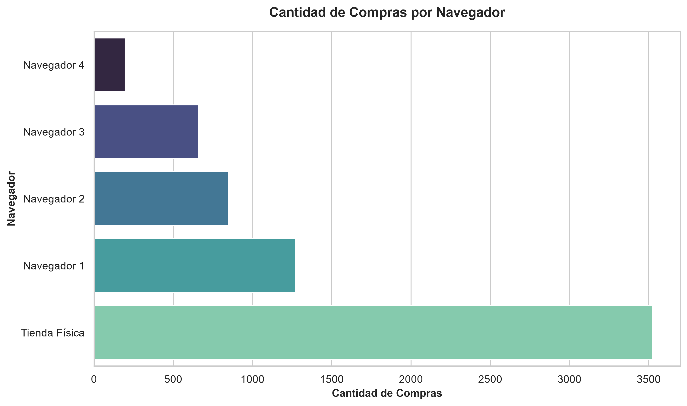

Para el navegador usamos barras, pero horizontales y ordenadas de menor a mayor. La decisión fue práctica: las etiquetas son textos largos ("Tienda Física", "Navegador 1", "Navegador 2"...), y en barras horizontales caben sin rotarse ni cortarse. El eje vertical (Y) muestra cada navegador y el horizontal (X) la cantidad de compras.

Al recorrer las barras de abajo hacia arriba vemos que la Tienda Física es imbatible: 3,523 compras, el 54.2% del total. Entre los navegadores, el más usado es el Navegador 1 (1,273; 19.6%), seguido del 2 (847) y el 3 (660), y el Navegador 4 queda relegado con solo 197 compras (3%). Cada vez que un navegador sube en el ranking, la barra crece de forma consistente, sin saltos raros: hay una jerarquía clara de preferencia.

### 2.4 Distribución de Compras por Género (pastel)

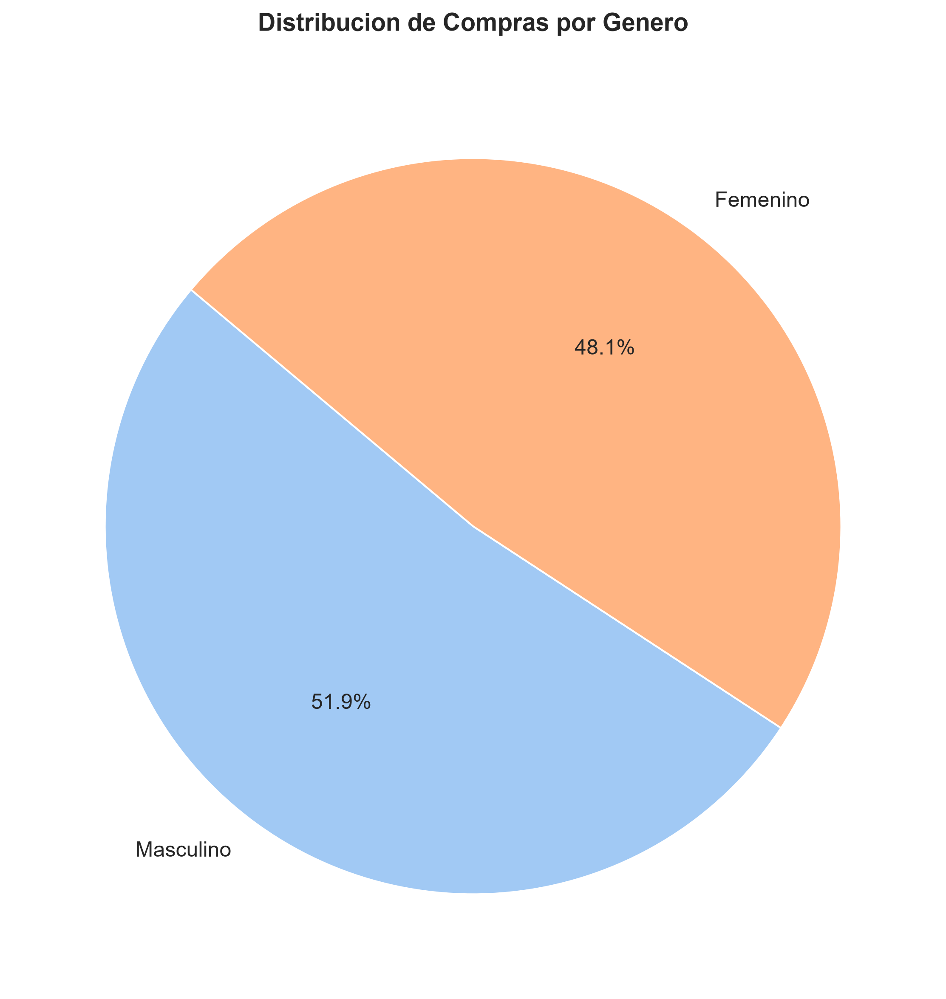

Cuando solo hay dos categorías y lo que queremos comunicar es qué proporción del total representa cada una, decidimos que un pastel era lo más honesto: cada rebanada es el peso relativo de ese grupo. Aquí las rebanadas representan el porcentaje de compras por género.

El resultado es casi un empate: Masculino con 51.9% (3,372 compras) contra Femenino con 48.1% (3,128). Es decir, el pastel está partido prácticamente a la mitad, con una ventaja masculina de menos de 4 puntos porcentuales. Para segmentar campañas por género no hay una diferencia de volumen que justifique inclinar la balanza.

### 2.5 Distribución de Edad de los Clientes (histograma)

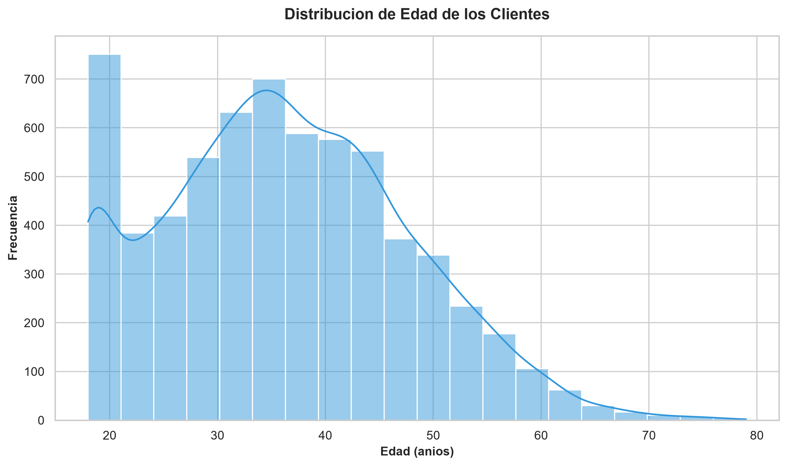

Para entender cómo están repartidas las edades de los clientes decidimos usar un histograma con curva de densidad (KDE). El eje horizontal (X) agrupa la edad en intervalos y el vertical (Y) cuenta cuántos clientes caen en cada intervalo; la línea azul suaviza esas barras para que se vea la "forma" de la población.

El gráfico nos cuenta que los clientes van de los 18 a los 79 años, con una media de 36.3, y que la mayoría se concentra entre los 30 y 40 años: el histograma sube hasta formar una campana y después baja de forma pareja. Cada vez que avanzamos desde los 18 años la frecuencia crece hasta ese pico central y luego decrece, un comportamiento casi normal. El grueso de los compradores es adulto joven, lo cual da una idea clara de a quién enfocarle la publicidad.

### 2.6 Monto de Compra vs. Tiempo en el Sitio (dispersión)

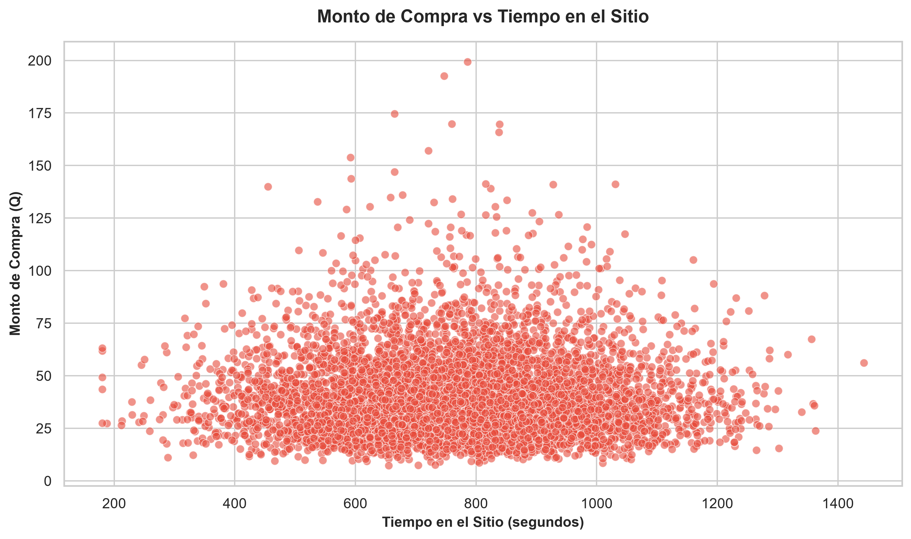

Queríamos saber si un cliente que pasa más tiempo en el sitio termina gastando más, y para dos variables numéricas la nube de puntos es la elección natural. El eje horizontal (X) es el tiempo en segundos y el vertical (Y) el monto de la compra; cada punto es una transacción, y usamos transparencia porque son 6,500 puntos y sin ella se empastaría todo.

La nube no tiene absolutamente ninguna dirección: hay compras caras y baratas en todos los tiempos, desde segundos hasta horas. No importa cuánto crezca el tiempo en X, los puntos en Y se quedan igual de dispersos. Eso coincide con el r = -0.005 de la matriz: **el tiempo en el sitio no explica el monto gastado**, y no hay correlación que aprovechar acá.

### 2.7 Venta Total por Género (cajas)

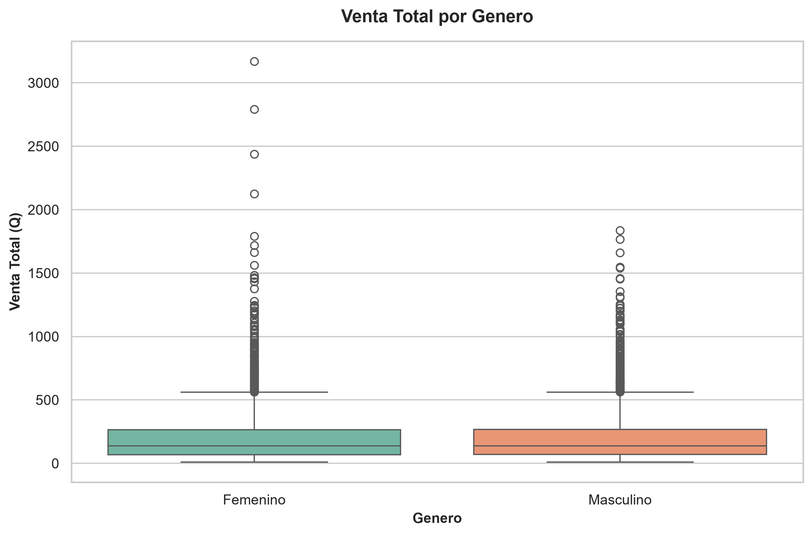

Para comparar la venta total entre géneros de forma más completa que con un promedio, decidimos usar cajas (boxplot). Cada caja resume, para cada género, la mediana (la línea del medio), el rango donde vive el 50% central de los clientes y los valores atípicos (los puntitos que se salen de los "bigotes").

Al comparar ambas cajas vemos que son casi gemelas: medianas y dispersiones muy parecidas, y en ambos géneros hay clientes de alto gasto que se escapan como puntos arriba de la caja. Cada vez que miramos un percentil, hombres y mujeres están alineados. La conclusión se suma a la del pastel y a la de la correlación: el género no genera diferencias relevantes en el gasto.

### 2.8 Ventas por Uso de Boletín y Vale (barras agrupadas)

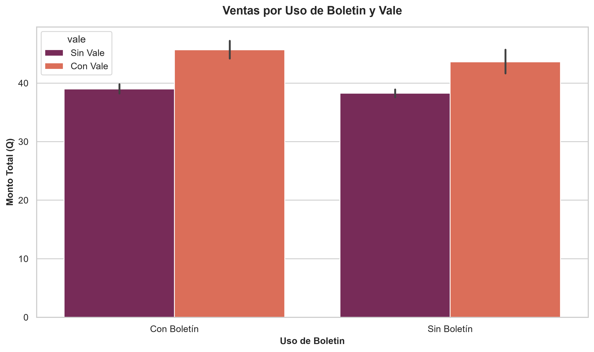

Como el boletín y el vale son dos variables categóricas que además ya vimos que se relacionan, decidimos cruzarlas con barras agrupadas: en el eje horizontal (X) va el uso de boletín (con o sin), y dentro de cada grupo las barras se dividen por el uso de vale; el eje vertical (Y) es el monto vendido. Así cada barra cuenta una de las cuatro combinaciones posibles.

La barra más alta es la de "Sin Boletín / Sin Vale", que aporta el mayor volumen de ventas, simplemente porque es la combinación más frecuente. Pero hay un detalle fino: dentro de los clientes con vale, la barra de quienes además usan boletín supera a la del vale solo, lo que refuerza visualmente la asociación positiva que encontramos en la sección 1.3. O sea, cuando el cliente usa un vale, el boletín parece "arrimar" más venta.

### 2.9–2.12 Gráficos de Correlación

Los 4 gráficos de correlación (edad vs. venta total, género vs. método de pago, boletín vs. vale y la matriz numérica) ya se presentaron y explicaron en la sección 1, con su mismo diseño e interpretación.

---

## 3. Selección y diseño de los gráficos

La regla que seguimos para elegir cada tipo de gráfico fue pensar primero qué queríamos comunicar y después escoger la forma que mejor lo contara, y no al revés. El resumen de esas decisiones es este:

- **Líneas para la tendencia mensual**, porque una serie de tiempo se lee naturalmente como una línea que sube y baja entre puntos.
- **Barras verticales para el método de pago**, porque comparan categorías discretas y, ordenadas de mayor a menor, destacan al instante el canal dominante.
- **Barras horizontales para los navegadores**, porque las etiquetas son largas y en horizontal se leen completas sin girar el texto.
- **Pastel para el género**, porque con dos categorías lo que interesa es la proporción del total, y una rebanada de pastel comunica eso de inmediato.
- **Histograma para la edad**, porque lo que importa es la forma y simetría de una variable continua, no comparar categorías.
- **Dispersión para monto vs. tiempo**, porque es el gráfico clásico para buscar correlación entre dos variables numéricas; la transparencia evita que la superposición de 6,500 puntos engañe al ojo.
- **Cajas para la venta total por género**, porque muestran mediana, dispersión y atípicos de un golpe, que es lo que necesitábamos para comparar dos grupos.
- **Barras agrupadas para boletín y vale**, porque cruzan dos variables categóricas y dejan ver el efecto combinado de las promociones.
- **Heatmaps para las correlaciones categóricas y la matriz numérica**, porque en un cruce de dos dimensiones el color + número es la forma más legible de detectar patrones.

Para mantener la coherencia visual, todos los gráficos usan el estilo `whitegrid` de Seaborn, paletas consistentes entre gráficos del mismo tipo y se exportan a 300 DPI para que luzcan bien en el informe final.

---

## 4. Código utilizado

Todo el análisis se implementó en Python con `pandas` para manipular los datos, `matplotlib` y `seaborn` para graficar, y `SQLAlchemy` para leer directamente de la base de datos sin volver a tocar el ETL:

- **`conexion.py`** — construye el engine SQLAlchemy con las credenciales del `.env`.
- **`graficas.py`** — genera los 8 gráficos variados de las secciones 2.1–2.8.
- **`correlaciones.py`** — calcula los coeficientes de Pearson e imprime los `r` en consola, además de generar los 4 gráficos de correlación de la sección 1.

Para reproducir:

```powershell
cd Practica1\graficacion
pip install -r requirements.txt
python graficas.py
python correlaciones.py
```

Ambos scripts imprimen en consola la ruta exacta de cada PNG guardado en `graficas/`, de modo que quede evidencia de la generación para el informe final.
