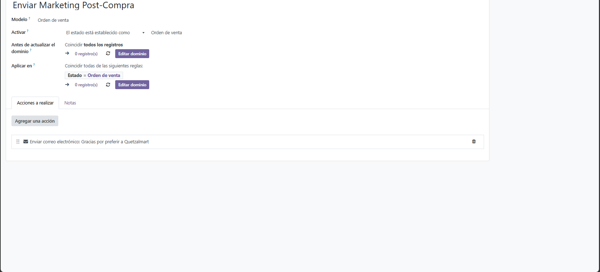
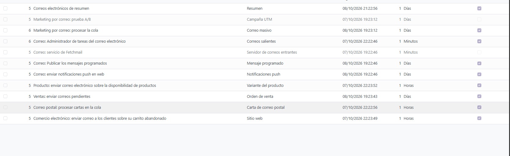
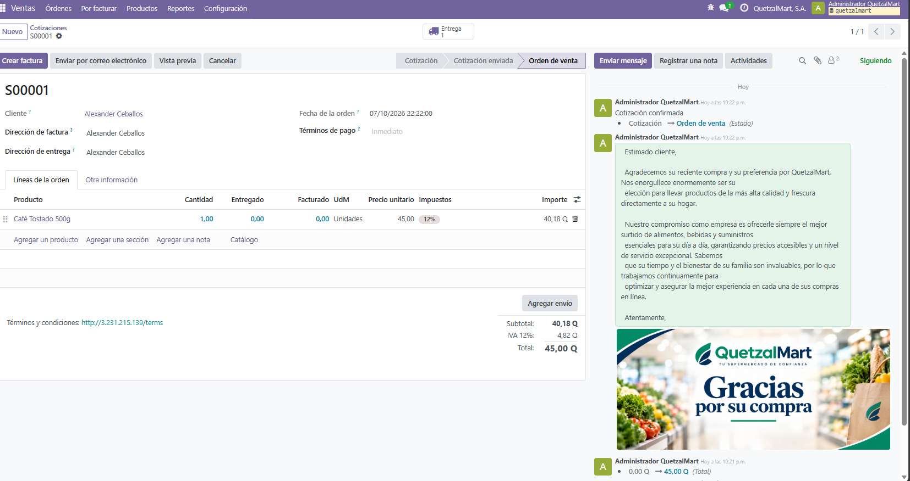
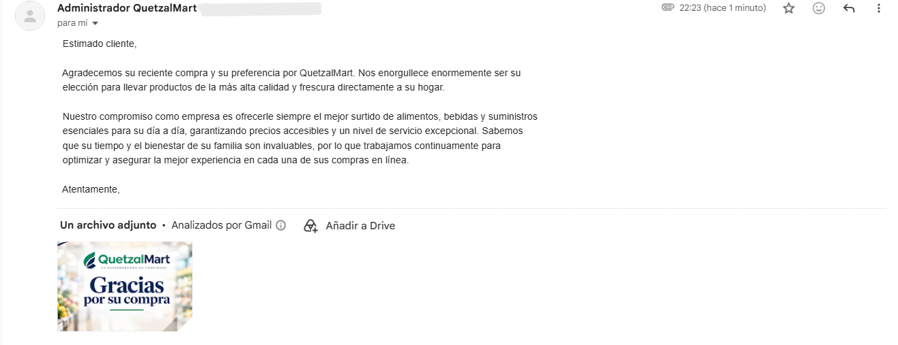

# Manual de Configuración: Módulo de Ventas, E-Commerce y Automatización de Marketing (CRM)

Este manual detalla los pasos de configuración realizados en Odoo para cumplir con los requerimientos del **Integrante 4**. El objetivo de esta fase es habilitar el portal web, configurar el E-commerce, el flujo de ventas, e integrar una automatización de correos electrónicos de marketing promocional que se dispara inmediatamente después de la confirmación de una compra.

---

## 1. Configuración de Pasarela de Pagos (E-Commerce)

Para permitir que los clientes finalicen sus compras desde la plataforma web:
1. Navegamos al módulo **Sitio Web** > **Configuración** > **Proveedores de pago**.
2. Activamos la opción de **Transferencia Bancaria** y la pusimos en modo *Test Mode* (Modo de prueba) para poder recibir simulaciones de pago por parte de los clientes sin requerir una tarjeta real.
3. Se publicó el método de pago para que sea visible en el *Checkout* del carrito de compras.

---

## 2. Configuración del Servidor de Correo Saliente (SMTP)

Para que el ERP pueda despachar correos masivos y de marketing con remitente profesional (y no un correo personal), configuramos un servidor SMTP.

1. **Ruta:** Menú `Ajustes` > `Ajustes Generales` > `Servidores de correo saliente`.
2. **Configuración:**
   - **Descripción:** Servidor SMTP QuetzalMart
   - **Correo Electrónico:** `quetzalmartg12@gmail.com`
   - **Servidor SMTP:** `smtp.gmail.com`
   - **Puerto:** `587`
   - **Seguridad:** `STARTTLS`
   - **Contraseña:** Se generó una *Contraseña de Aplicaciones* desde los ajustes de seguridad de Google para permitir a Odoo enviar correos.
3. **Prueba de Conexión:** Exitosa.

---

## 3. Creación de la Regla Automatizada de Marketing

Se requiere que, tras cada compra, el cliente reciba una promoción de forma automática (según rúbrica). Para lograrlo:

1. **Diseño de Plantilla:** Se creó la plantilla de correo *"Gracias por preferir a Quetzalmart"*, incluyendo un banner corporativo promocional utilizando el bloque de imagen nativo de Odoo y un texto de agradecimiento formal.
2. **Creación de Acción:** Menú `Ajustes` > `Técnico` > `Reglas de Automatización`.
3. **Detalles de la Regla:**
   - **Modelo:** `Orden de Venta` (`sale.order`)
   - **Activar:** El estado está establecido como **Orden de venta**. Esto garantiza que no se envíe al crear una simple cotización, sino solo cuando el cliente confirma su compra.
   - **Acción a realizar:** Enviar correo electrónico usando la plantilla diseñada.

---

## 4. Ajuste del Reloj de Odoo (Cron Job)

Por defecto, Odoo procesa la cola de correos cada 15 o 60 minutos. Para agilizar la demostración y envío de la campaña:
1. Vamos a `Técnico` > `Acciones planificadas`.
2. Seleccionamos **Correo: Administrador de tareas del correo electrónico**.
3. Se ajustó el valor de ejecución a **1 Minuto**.

---

## 5. Pruebas y Resultados

Para confirmar el funcionamiento *End-to-End*:
1. Se generó una **Cotización** manual con datos del cliente y un correo real.
2. Se hizo clic en el botón **Confirmar**.
3. El documento pasó a estado **Orden de Venta** (compra confirmada), disparando en segundo plano la automatización.
4. El registro de eventos (Chatter) dejó constancia del envío del correo de Marketing.

Minutos después, el correo de marketing fue recibido exitosamente en la bandeja de entrada del cliente final, verificando el diseño del asunto, la redacción y el banner de marca.

Con esto, se concluye la integración del Portal Web, ERP (Ventas) y CRM (Marketing). El único paso pendiente es generar el volumen de datos transaccionales masivos (**150 ventas** y **20 cotizaciones**) mediante importación vía Excel una vez que los catálogos de productos base hayan sido cargados por el módulo de Compras.
