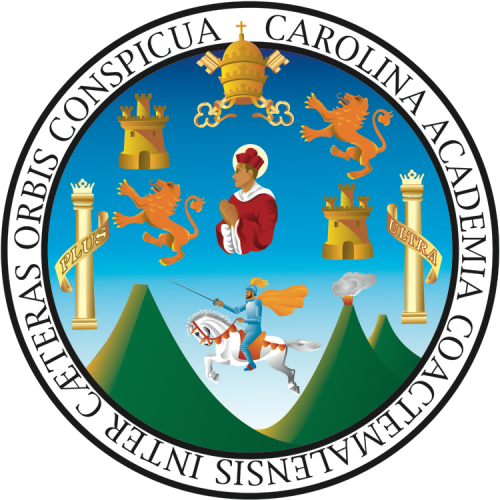

  
   
  <strong>UNIVERSIDAD DE SAN CARLOS DE GUATEMALA</strong> 
  Facultad de Ingenieria 
  Escuela de Ciencias y Sistemas

---

<h1 align="center">Repositorio Laboratorio Sistemas Organizacionales y Gerenciales 2</h1>

<em>Seccion N</em> | Segundo Semestre 2026

---

<h2 align="center">Desarrolladores</h2>

> **Jens Jeremy Pablo Sosof** — Carnet: `202102771`
>
> **Adler Alejandro Perez Asensio** — Carnet: `202200329`
>
> **Alexander Santiago Ceballos Gil** — Carnet: `202109812`
>
> **Engel Emilio Coc Raxjal** — Carnet: `202200314`
>
> **Alberto Josue Hernandez Armas** — Carnet: `201903553`

---

<em>Sistemas Organizacionales y Gerenciales 2 — Laboratorio</em>

---

## Practicas

- **Practica 1 — **
